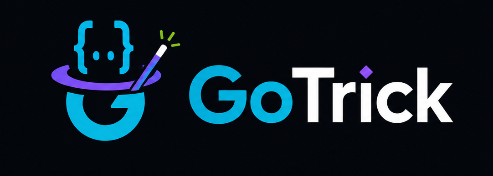
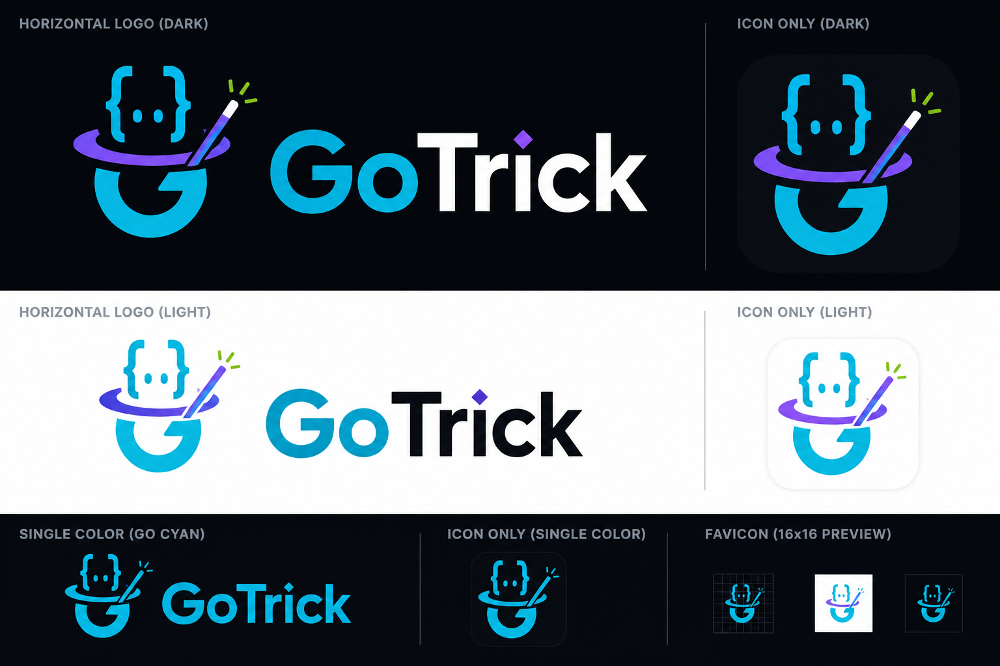

<p align="center">
  <a href="README.md">English</a> ·
  <a href="README.id.md">Bahasa Indonesia</a>
</p>

<p align="center">
  <picture>
    <source media="(prefers-color-scheme: dark)" srcset="assets/02_BANNER_DARK.png">
    <source media="(prefers-color-scheme: light)" srcset="assets/03_BANNER_LIGHT.png">
    
  </picture>
</p>

<p align="center">
  
</p>

<h1 align="center">GoTrick</h1>

<p align="center">
  <strong>Latihan Go terstruktur — dari fundamental sampai interview fintech.</strong>
</p>

<p align="center">
  <a href="https://github.com/faisalaffan/gotrick/actions/workflows/mdbook.yml"></a>
  
  
</p>

---

## Tentang

GoTrick adalah kumpulan contoh kode Go yang dirancang untuk backend engineer yang persiapan ke role fintech. Mencakup dari tipe dasar sampai concurrency pattern production-grade — semua tanpa dependency eksternal.

## Dokumentasi

**[Baca dokumentasi lengkap →](https://faisalaffan.github.io/gotrick/)**

## Topik

| Bagian | Topik | File |
|--------|-------|------|
| **Fundamentals** | Types, zero values, pointer, structs, interfaces, errors, goroutines, channels, defer, panic, recover | 6 |
| **Standard Library** | Fiber HTTP, JSON, context, sync primitives, I/O, bufio, time | 7 |
| **Concurrency** | Worker pool, fan-out/fan-in, pipeline, select, atomic vs mutex, race condition | 6 |
| **Idiomatic Go** | Embedding, functional options, error wrapping, table-driven test | 4 |
| **Performance** | Benchmark, pprof profiling, escape analysis | 3 |
| **Networking** | HTTP retry, gRPC, WebSocket | 3 |
| **Interview Prep** | Concurrent transfer, rate limiter, graceful shutdown, retry backoff, idempotency | 5 |

## Mulai Cepat

```bash
# Clone
git clone git@github.com:faisalaffan/gotrick.git
cd gotrick

# Jalankan contoh
go run ./interview/transfer/           # Concurrent transfer + deadlock avoidance
go run ./concurrency/worker_pool/      # Bounded worker pool
go run ./fundamentals/interfaces/      # Interface basics + nil trap

# Default (lihat daftar contoh)
go run ./fundamentals/

# Test
go test ./... -v
go test -bench=. -benchmem ./performance/
```

## Cara Kerja

Setiap contoh ada di direktorinya sendiri — satu `main.go` per package:

```bash
# interview/transfer/main.go → go run ./interview/transfer/
go run ./interview/transfer/
```

Lihat [dokumentasi lengkap](https://faisalaffan.github.io/gotrick/) untuk semua tag dan penjelasan.

## Prasyarat

- Go 1.21 atau lebih baru
- Semua contoh menggunakan **standard library** — tidak butuh dependency eksternal

## Sistem Desain

<p align="center">
  
</p>

## Lisensi

MIT — lihat [LICENSE](LICENSE).
